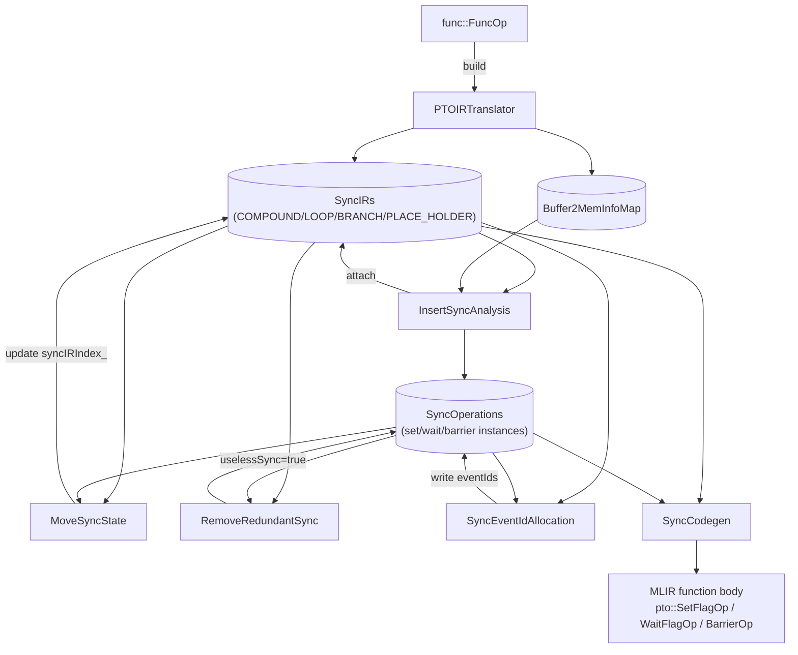
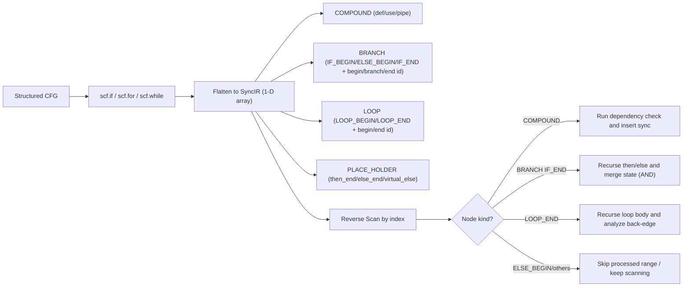
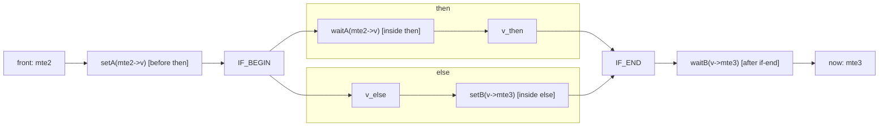
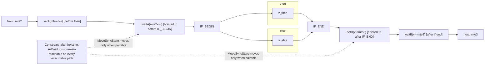
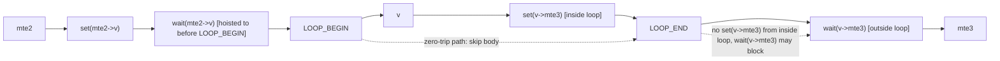
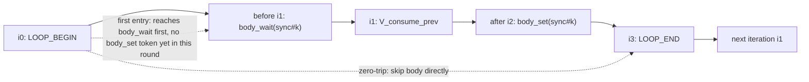
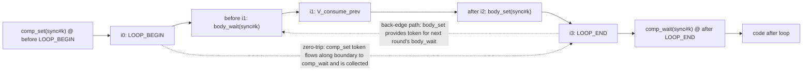

# PTOAS InsertSync Auto-Synchronization Mechanism

This document revolves around three core questions: how dependencies are determined, how synchronization is inserted, and how event IDs are allocated.

---

## 1. Background: Out-of-Order Risks and the Need for Synchronization from the Hardware Architecture

In PTOAS, instructions do not execute serially in source-code order. When multiple pipes run in parallel, a race condition can occur whenever a producer and consumer access the same underlying memory. The role of InsertSync is to translate these real dependencies into the minimum necessary synchronizations.

Common pipe types used throughout this document:

- `PIPE_MTE2`: Inbound transfer, typically GM -> L1/UB.
- `PIPE_V`: Vector computation.
- `PIPE_M`: Matrix computation.
- `PIPE_MTE3`: Outbound transfer, typically L1/UB -> GM.
- `PIPE_S`: Scalar and control/auxiliary operations.

The most common data path is `MTE2 -> V/M -> MTE3`. Synchronization is a necessary condition for correctness whenever pipes share underlying memory.

---

## 2. The Pipeline Is Not Complex, but Order Matters

The `PTOInsertSync` pass sequence is:

`PTOIRTranslator -> InsertSyncAnalysis -> MoveSyncState -> RemoveRedundantSync -> SyncEventIdAllocation -> SyncCodegen`

This pipeline can be broken into three stages:

1. Identify dependencies and generate sync analysis objects.
2. Annotate synchronization positions at control-flow boundaries.
3. Allocate event IDs and lower them into real instructions.

---

## 3. Core Data Structures

The implementation lives in `lib/PTO/Transforms/InsertSync/`, with corresponding headers in
`include/PTO/Transforms/InsertSync/`. This section lists the key types shared across the entire pass pipeline; later sections reference these fields repeatedly when describing algorithms.

### 3.1 Top-Level Containers

| Type Alias | Definition | Role |
| --- | --- | --- |
| `SyncIRs` | `SmallVector<std::unique_ptr<InstanceElement>>` | Flattened instruction sequence, shared across passes |
| `SyncOperations` | `SmallVector<SmallVector<std::unique_ptr<SyncOperation>>>` | Sync-pair storage; outer index = `kSyncIndex`, inner 0/1 = set/wait (barriers occupy a single slot) |
| `Buffer2MemInfoMap` | `DenseMap<Value, SmallVector<std::unique_ptr<BaseMemInfo>>>` | SSA Value → a set of `BaseMemInfo`, used to track views/aliases |
| `SyncOps` | `std::deque<SyncOperation*>` | `pipeBefore` / `pipeAfter` sync queues on a node |

`PTOInsertSyncPass::runOnOperation` (`PTOInsertSync.cpp:64`) creates all four containers at once, then passes them sequentially to the six downstream passes. The containers are not materialized into real `pto::SetFlagOp / WaitFlagOp / BarrierOp` until the final `SyncCodegen::Run()` stage.

### 3.2 SyncIR Nodes: The `InstanceElement` Family

`InstanceElement` (`SyncCommon.h:229`) is the abstract base class. Every node carries:

- `unsigned kIndex`: Stable index into `syncIR_`, exposed via `GetIndex()`.
- `Operation* elementOp`: Pointer to the source MLIR Op (COMPOUND nodes point to the annotated op; control-flow nodes point to their region-boundary op, e.g. `scf::ForOp`, `scf::IfOp`, `scf::YieldOp`).
- `SyncOps pipeBefore` / `SyncOps pipeAfter`: Queues of sync instructions attached before/after the node.
- `KindTy kKindTy`: One of `COMPOUND`, `LOOP`, `BRANCH`, `PLACE_HOLDER`.

Derived classes are distinguished by kind; their fields are described below:

| Derived Class | Key Fields | Description |
| --- | --- | --- |
| `CompoundInstanceElement` | `defVec`, `useVec` (both `SmallVector<const BaseMemInfo*>`), `kPipeValue` (`PipelineType`), `opName`, `compoundCoreType` (`TCoreType`) | Compute/transfer instruction node; `def/use` are the inputs to the dependency check during reverse scan. `compoundCoreType` distinguishes CUBE / VECTOR, used downstream for barrier selection. |
| `LoopInstanceElement` | `beginId`, `endId`, `kLoopKind` (`LOOP_BEGIN`/`LOOP_END`) | A pair of nodes sharing the same `beginId/endId`; endpoints appear in dual form. |
| `BranchInstanceElement` | `beginId`, `branchId`, `endId`, `kBranchKind` (`IF_BEGIN`/`ELSE_BEGIN`/`IF_END`) | `branchId` = start of the else interval; `branchId == endId` when there is no else. |
| `PlaceHolderInstanceElement` | `parentScopeId`, `isVirtualElse`, `parentIfOp` | Placeholder anchor at the tail yield of then/else; when `isVirtualElse=true`, `SyncCodegen` creates a real else block on demand. |

The three enums `KindTy`, `KindOfLoop`, `KindOfBranch` (`SyncCommon.h:234/267/290`) encode node kinds into the IR; `dyn_cast` or `getKind()` is used to dispatch during reverse scan.
`MAX_MULTI_BUFFER_NUM = 16` (`SyncCommon.h:35`) is the upper bound on multi-buffer slots, which determines the fixed length of `SyncRecordList`.

### 3.3 Memory Semantics Layer: `BaseMemInfo`

`BaseMemInfo` (`SyncCommon.h:86-131`) is the smallest unit for dependency determination:

| Field | Type | Purpose |
| --- | --- | --- |
| `baseBuffer` | `Value` | SSA buffer directly visible to the current op (may be the top of a view/cast chain) |
| `rootBuffer` | `Value` | Statically-known deepest root buffer (`alloc_tile` / kernel arg / `memref.alloc`) |
| `scope` | `pto::AddressSpace` | Address space (GM/MAT/VEC/ACC/LEFT/RIGHT, etc.) |
| `baseAddresses` | `SmallVector<uint64_t>` | List of known offsets; used with `allocateSize` for precise interval overlap checks |
| `allocateSize` | `uint64_t` | Size in bytes |

`operator==` (line 111) requires `baseAddresses`, `rootBuffer`, `scope`, `allocateSize`, and `baseBuffer` to all be equal to consider two instances the same buffer. This is the "strict equality" check in alias analysis; a hit allows the dependency path to be taken directly.

### 3.4 Sync Instructions: `SyncOperation`

`SyncOperation` (`SyncCommon.h:137-219`) describes a single set/wait/barrier instance. Key fields fall into two groups:

Identity and position:

- `type_`: `SET_EVENT` / `WAIT_EVENT` / `PIPE_BARRIER` / `PIPE_BARRIER_CUBE`
  / `PIPE_BARRIER_VECTOR` / `SYNC_BLOCK_SET` / `SYNC_BLOCK_WAIT` / `SYNC_BLOCK_ALL`.
- `srcPipe_`, `dstPipe_`: Pipeline direction.
- `kSyncIndex_`: Pair index in `syncOperations_`; set and wait share the same value.
- `syncIRIndex_`: Index of the SyncIR node this sync is attached to; updated via `SetSyncIRIndex` during `MoveSyncState`.
- `forEndIndex_`: Optional loop-end marker; when present it indicates this sync is related to a back-edge.

Allocation and pruning:

- `eventIds` (`SmallVector<int>`) + `eventIdNum`: Event ID list filled in after allocation; length = `eventIdNum` (greater than 1 in multi-buffer scenarios).
- `depRootBuffers`: Set of root buffers involved in the dependency chain that produced this sync pair; used as a heuristic and debug aid during allocation/widening. `RemoveRedundantSync` uses pipe-pair semantics when removing set/wait redundancies, and does not require root-buffer equality.
- `uselessSync`: Set to true by `RemoveRedundantSync` on a hit; the node is then removed from `pipeBefore/After`.
- `isCompensation`: Reserved for synthetic compensation syncs pre-generated by the analysis phase. Loop back-edge head/tail compensation pairs are generated by `SyncEventIdAllocation` after redundancy removal.
- `lowestCommonAncestorBuffer`, `reuseCntForWiden`, `reallocatedLoopHeadTailSync`: Auxiliary state for the allocation phase (used by widen/reallocate).

### 3.5 Local State for Reverse Scan: `SyncRecord`

`SyncRecord` (`InsertSyncAnalysis.h:25`) is the working set maintained for "current `now`" during reverse scan:

- `alreadySync`: `std::array<bool, PIPE_LAST + 1>`. Once a dependency for a given pipe is covered by a set/wait pair, its slot is set to 1 and subsequent hazards from the same source pipe are not synced again. Note this is a **pipe-level state** that does not distinguish individual `syncIndex` values; once `alreadySync[PIPE_MTE2] = true`, all subsequent dependencies originating from `PIPE_MTE2` are considered covered.
- `syncFinder`: `DenseMap<int, bool>`, indexed by `kSyncIndex`; records only "a wait side of a given `syncIndex` has been seen during reverse scan." It does not record the set side, nor is it equivalent to "some pipe is already synchronized." Only when the reverse scan subsequently encounters the matching set of the same `syncIndex` can that set's source pipe be promoted to `alreadySync`. This state machine is illustrated in Section 6.1 "Linear Example B" and the zero-trip example in Section 6.4.

`syncFinder` update direction is easy to misread: `UpdateSyncRecord` first checks `recordFinder[syncIndex]` to determine whether the current set can close a wait already seen; only when the current sync is `WAIT_EVENT` / `SYNC_BLOCK_WAIT` does it execute `recordFinder[syncIndex] = true`. Therefore the `syncFinder-only` strategy carries "wait-side clues," not the fact that synchronization has already been completed.

`SyncRecordList = std::array<SyncRecord, MAX_MULTI_BUFFER_NUM>`: each multi-buffer slot is maintained independently, without cross-contamination.

### 3.6 Event ID Allocation Pool: `EventCyclePool` / `SyncCycle`

`SyncEventIdAllocation.h:25-37` gives the allocation-phase constants and pool structure:

```cpp
constexpr uint kTotalEventIdNum            = 8;   // Upper limit of usable IDs for ordinary syncs
constexpr uint kBlockSyncSetWaitEventIdNum = 16;  // BlockSync pool size
constexpr uint kBlockSyncAllCubeEventId    = 14;  // ID reserved for BlockAllCube
constexpr uint kBlockSyncAllVectorEventId  = 15;
constexpr uint kMaxWidenTryNum             = 99;  // Max widen-reuse attempts

struct EventCyclePool {                 // Pool for a single (srcPipe,dstPipe) pair
  SmallVector<SmallVector<unsigned>> slot;  // slot[id] = [s0, e0, s1, e1, ...]
};
using SyncCycle = DenseMap<int, EventCyclePool>;  // key = ScopePair(s)
```

`ScopePair(s)` encodes `(srcPipe, dstPipe)` as `((dstT << 8) | srcT) + 1`, so syncs in different directions compete for independent ID pools; BlockSync uses 0 as a placeholder and is isolated from ordinary syncs. Each ID stores paired lifetime endpoint sequences in `slot[i]`; conflicts are checked on new allocation, and `WidenEventId` / `ReallocatedEventId` attempt reuse and reallocation when IDs are scarce.

### 3.7 Codegen Intermediate Structure: `SyncPipeBuild`

Small structure defined in `SyncCodegen.h:26`:

```cpp
struct SyncPipeBuild { SyncOps pipeBefore; SyncOps pipeAfter; };
```

`SyncCodegen::UpdateOpInsertSync` aggregates the `pipeBefore/pipeAfter` of each `SyncIR` node into `DenseMap<const Operation*, SyncPipeBuild>`, then locates the concrete MLIR op in a walk phase, and finally emits `pto::SetFlagOp` / `pto::WaitFlagOp` / `pto::BarrierOp`.

---

## 4. Intra-Pass Data Flow and Key Functions

`PTOInsertSyncPass::runOnOperation` (`PTOInsertSync.cpp:64-145`) runs six sub-passes in the order below; each step consumes upstream containers and writes back to the same set of containers. This section provides a three-part summary (Input → Main Logic → Output) for each stage, annotated with key entry functions and locations.

### 4.0 Pass Entry and Short-Circuit

The very first thing after entering the pass is not analysis but a walk over the function body (`PTOInsertSync.cpp:73-84`): if `pto::SetFlagOp / WaitFlagOp / RecordEventOp / WaitEventOp` already exist, return immediately — to avoid layering automatic sync on top of manually inserted sync. Additionally, `PTOInsertSync.cpp:127-131` separately checks whether the function contains `pto::TGather/TGatherB/TScatter/MGather/MScatter` ops; if so, `RemoveRedundantSync` is skipped (gather/scatter interactions with pipe-pair simplification conflict on A5).

### 4.1 `PTOIRTranslator::Build` (`PTOIRTranslator.cpp`)

- Input: `func::FuncOp`, empty `SyncIRs`, `Buffer2MemInfoMap`.
- Main logic:
  1. `UpdateKernelArgMemInfo()`: Registers kernel arguments as GM root buffers.
  2. `RecursionIR(&func.getBody())`: Pre-order traversal of the region:
     - `pto::AllocTileOp` / `DeclareTileMemRefOp` / `PointerCastOp` / `memref::AllocOp` are written into `buffer2MemInfoMap_` via `Update*MemInfo`.
     - View / Subview / Cast / Mov call `UpdateAliasBufferInfo(result, source)`, chaining the derived buffer's `BaseMemInfo` back to the original root.
     - `scf::ForOp` / `WhileOp` / `IfOp` / `YieldOp` are translated into `LoopInstanceElement` / `BranchInstanceElement` / `PlaceHolderInstanceElement` via `UpdateForOpInfo` / `UpdateWhileOpInfo` / `UpdateIfOpInfo` / `UpdateYieldOpInfo`, ensuring `beginId/branchId/endId` are consistent across paired nodes.
     - Compute/transfer ops that implement `OpPipeInterface` go through `UpdatePTOOpInfo`: the pipeline type is retrieved via `getOpPipeline(op)`, reads and writes are distinguished using `MemoryEffectOpInterface`, `UpdateDefUseVec` fills `defVec/useVec`, and finally a `CompoundInstanceElement` is constructed and `emplace_back`'d into `syncIR_`.
- Output: `SyncIRs` (structured CFG flattened but with semantic boundaries preserved), `Buffer2MemInfoMap`.
- Key invariant: Ops with `PipelineType::PIPE_UNASSIGNED` do not participate in sync analysis and are skipped.

### 4.2 `InsertSyncAnalysis::Run` (`InsertSyncAnalysis.cpp`)

- Input: `SyncIRs` (from 4.1), `MemoryDependentAnalyzer`, empty `SyncOperations`.
- Main logic (`InsertSyncAnalysis.cpp:43-63`):
  1. Top-level traversal of `syncIR_`:
     - `CompoundInstanceElement` → `DealWithCompoundSync` (core sync insertion).
     - `LoopInstanceElement(LOOP_END)` → `DealWithLoopSync` (back-edge compensation modeling).
     - `BranchInstanceElement` / `PlaceHolderInstanceElement` are skipped at the top level and handled by recursion.
  2. `DealWithCompoundSync` calls `InsertSeqSync(now, syncIR_, 0, now->GetIndex(), …)`: reverse-scans from `now-1`, dispatching by node kind:
     - `CompoundInstanceElement` → `InsertSync` → `MemAnalyze`: first applies `IsNoNeedToInsertSync` for quick pruning (same PIPE_S, same op and not a back-edge), then calls `MemoryDependentAnalyzer::DepBetween` to detect RAW/WAR/WAW; on a hit, calls `InsertSyncOperation` to write set/wait or barrier, and maintains `SyncRecordList` via `UpdateAlreadySync`.
     - `LoopInstanceElement` → `InsertLoopSync`: recursively scans a loop body slice. Because a loop may execute zero times, the `alreadySync` learned from body scan cannot be promoted to the outer scan state; the current implementation only copies the body-learned `syncFinder` back to the outer scope. This avoids the loop-outside sync false-deletion on zero-trip paths (issue #533) while preserving set/wait matching clues for nested K-loops (issue #564).
     - `BranchInstanceElement` → `InsertBranchSync`: recursively scans then/else and merges state via `MergeAlreadySync` (intersection — only when both branches sync is the bit set).
  3. `DealWithLoopSync` copies the `[beginId, endId)` slice into a local `backSyncIr`, then uses `InsertBackForSync` to pair compound nodes in the loop body with producers from the "previous iteration" — this is the entry point for the cross-iteration dependency implementation described in Section 6.4.
  4. After all scans complete, if `insertBarAllAtLast=true`, calls `InsertLastPipeAll` to append a global barrier after the last compound.
- Output: `pipeBefore/pipeAfter` on nodes in `SyncIRs` are populated with `SyncOperation*`; `SyncOperations` holds the corresponding `unique_ptr` instances.
- Key invariant: Each `kSyncIndex` corresponds to at most 2 inner slots (set + wait) or 1 inner slot (barrier).

### 4.3 `MoveSyncState::Run` (`MoveSyncState.cpp`)

- Input: Output of 4.2.
- Main logic:
  - `MoveOutBranchSync`: Iterates over `IF_BEGIN` nodes; calls `PlanMoveOutBranchSync` on then/else sub-intervals, then routes to `PlanMoveOutIfWaitSync` (hoist wait out) and `PlanMoveOutIfSetSync` (push set out). A match requires that at least one side of the paired set/wait is entirely outside the branch.
  - `MoveForSync`: Loop version; `MoveOutSync` → `PlanMoveOutWaitSync` / `PlanMoveOutSetSync` hoists upward-movable syncs to before `LOOP_BEGIN` and sinks downward-movable syncs to after `LOOP_END`, making boundary shapes readable and providing anchors for downstream compensation.
- Output: `pipeBefore/pipeAfter` and `SyncOperation::syncIRIndex_` updated in-place.
- Note: MoveSyncState does not change `kSyncIndex`; set/wait are still paired through `syncOperations_[k]`. It only "relocates the attachment point."

### 4.4 `RemoveRedundantSync::Run` (`RemoveRedundantSync.cpp`)

- Trigger condition: See Section 4.0; skipped entirely if the function contains gather/scatter ops.
- Input: Output of 4.3.
- Main logic:
  1. Collect all set/wait pairs where `syncOperations_[k].size()==2`, sorted by `forEndIndex` / `kSyncIndex` (inner first).
  2. For each pair `(setFlag, waitFlag)`: skip pairs marked `isCompensation`, then run `CheckAllSync`.
  3. `CheckAllSync` → `CheckRepeatSync` scans `pipeBefore/pipeAfter` in the `[setIRIndex, waitIRIndex]` interval; calls `CheckBranchBetween` for branches and `CheckLoopBetween` for loops. `CanMatchedSync` uses a `SmallVector<bool>` as a `syncFinder` state machine: first sees a set (other than the same `kSyncIndex`), sets the bit; then sees the matching wait to confirm the pair; if the inner complete sync pair has the same pipe pair and its `eventIdNum` is no larger than the outer sync pair, the outer sync pair is considered covered.
  4. On a hit, sets `uselessSync=true` and removes the node from the attachment queue via `InstanceElement::RemoveSync`.
- Output: Syncs marked redundant remain in `syncOperations_` (for printing/debugging) but no longer appear in any `SyncIR` node's `pipeBefore/After`.
- Conservative boundaries: `CheckLoopBetween` returns false unconditionally because the loop may execute zero times; `CheckBranchBetween` requires both then and else to provide coverage before declaring redundancy.

### 4.5 `SyncEventIdAllocation::Allocate` (`SyncEventIdAllocation.cpp`)

- Input: Output of 4.4.
- Main logic (following the `Allocate(runNum=0)` flow):
  1. **First-round allocation**: Iterates over `syncIR_`; for each node's `pipeBefore` with a set/wait pair that has not yet been assigned an ID, calls `AllocateEventId → SetEventId`:
     - `ScopePair(sync)` selects the ID pool;
     - `GetEventPool` + `FindUseEventID` + `CheckSyncLifeCycleConflict` collect conflicts;
     - Prefers a free ID (`GetEventIdIdleStatus`), otherwise reuses an available one (`GetAvailableEventId` / `UpdateBlockAvailableEventId`);
     - After selection, calls `SetEventPool` and `SetUseEventID` to write back lifetimes; for back-edges, `UpdateBackwardMatchSync` attaches the compensation head/tail pair to the same ID.
  2. **Widening**: Iterates again; calls `WidenEventId` / `TryWidenByOtherSync` to attempt merging adjacent intervals within `kMaxWidenTryNum` attempts, reducing span and increasing reuse rate.
  3. **Back-edge cleanup**: `IgnoreBackHeadAndTailSync` removes placeholder back-edge compensation syncs from the allocation view, preventing them from competing for IDs.
  4. **Reallocation**: If `reallocatedPipePair` is non-empty, calls `ReallocatedEventId` to retry with `eventIdNum=1`; if necessary, recursively calls `Allocate(runNum+1)`.
  5. **Downgrade to PIPE_ALL**: `ChangeNoEventIdSyncToPipeAll` converts syncs that still have no assigned ID to global barriers, guaranteeing code can be generated (correctness at the cost of performance).
- Key constants: `kTotalEventIdNum=8`, `kBlockSyncSetWaitEventIdNum=16`, `kBlockSyncAllCubeEventId=14`, `kBlockSyncAllVectorEventId=15`.
- Output: Each `SyncOperation::eventIds` not marked as useless has been written with a valid ID.

### 4.6 `SyncCodegen::Run` (`SyncCodegen.cpp`)

- Input: Output of 4.5, the entire `func`.
- Main logic:
  1. `UpdateOpInsertSync(rewriter)`: Iterates over `syncIR_`, projecting each node's `pipeBefore/pipeAfter` into `op2InsertSync : Operation* → SyncPipeBuild`:
     - `CompoundInstanceElement`: copied directly;
     - `LoopInstanceElement(LOOP_END)`: registers `LOOP_BEGIN`'s `pipeBefore` before the `scf::ForOp` and its own `pipeAfter` after the `scf::ForOp`;
     - `BranchInstanceElement(IF_END)`: handles the `scf::IfOp` similarly;
     - `PlaceHolderInstanceElement`: if `isVirtualElse=true` and the `scf::IfOp` lacks an else region, proactively creates an empty else block (with a `scf::YieldOp`) as an anchor.
  2. `func.walk` locates each op that has attachments: processes `pipeBefore` with `beforeInsert=true`, then processes `pipeAfter` in reverse order with `beforeInsert=false`; each sync goes through `SyncInsert`:
     - `PIPE_BARRIER*` → `CreateBarrierOp`; on A5, `PIPE_V` barriers are not emitted and `PIPE_ALL` is deferred to the tail; adjacent barriers of the same kind are deduplicated via `hasNeighborBarrier`;
     - `eventIds.size()==1` → `CreateSetWaitOpForSingleBuffer`: directly constructs `pto::SetFlagOp` / `pto::WaitFlagOp` (distinguished by `isSyncWaitType()`);
     - `eventIds.size()>1` → `CreateSetWaitOpForMultiBuffer`: generates a runtime selector via `GetBufferSelected` (`createNestedIndexModular` cached in `loop2BufferCounter`).
  3. `AppendAutoSyncTailBarrierIfNeeded`: If the analysis phase required a trailing PIPE_ALL barrier, appends one before every `func::ReturnOp`.
- Output: The MLIR function body now contains complete `pto::SetFlagOp` / `WaitFlagOp` / `BarrierOp`; the pass ends.

### 4.7 Overall Data Flow Diagram



---

## 5. Dependency Identification: def/use and alias Are Two Sides of the Same Coin

`def/use` analysis does not directly compare SSA names; instead it operates on `BaseMemInfo`. The most critical fields are `rootBuffer`, `scope`, `baseAddresses`, and `allocateSize`.

Hazard detection covers three relationship types:

- RAW: `now.use` vs. `front.def`
- WAR: `now.def` vs. `front.use`
- WAW: `now.def` vs. `front.def`

When a hit occurs, the handling rule is straightforward: same pipe → insert `barrier`; cross-pipe → insert `set/wait`.

### 5.1 How Alias Is Actually Determined

The current implementation is not a "strong-proof AA" but a correctness-first may-alias rule:

1. If `scope` differs, they are definitely not aliased.
2. For `GM`, compare roots first and trace `realRoot` if necessary.
3. If both address and size are known, perform interval overlap check.
4. If information is missing (unknown address or unknown size), conservatively treat as "possibly overlapping."

This rule is biased toward conservatism when information is insufficient, but it does not sacrifice correctness. Finer-grained analysis for dynamic shape/offset scenarios will continue to be refined in the future.

### 5.2 Example: `[V][V][MTE3]`

Two `V` ops may semantically write to two non-overlapping subviews under the same root.
If precise offset/size is available statically, the system will determine no overlap.
If not, it treats them as "possibly overlapping," and `MTE3` will then depend on both `V` ops.

This is not an algorithmic error; it is the consequence of the conservative strategy.

---

## 6. Sync Insertion: Linear, Branch, Loop

### 6.1 Linear Sequence

In a linear sequence, the algorithm is a two-level traversal:

1. Outer: select the current instruction `now` in order.
2. Inner: reverse-scan `front` from `now-1` backward.

Each reverse scan maintains a per-pipe-indexed state `alreadySync`.
It is not a global state but rather "for the current `now`, whether the dependency from a given source pipe has already been covered by some sync pair."

When `front` and `now` hit a hazard:

- Same pipe: attach a `barrier` to `now.pipeBefore`.
- Cross-pipe: attach `set(src=frontPipe, dst=nowPipe)` to `front.pipeAfter` and the corresponding `wait` to `now.pipeBefore`.

After insertion, set `alreadySync[frontPipe]=true` to suppress duplicate syncs of the same kind.

#### Linear Example A: `[MTE2][V][MTE3]`

This example is clearest when examined in two rounds.

First round, `now = V`:

- Reverse scan hits `front = MTE2` dependency;
- Insert `set(MTE2->V)` (attached to `MTE2.pipeAfter`) and `wait(MTE2->V)` (attached to `V.pipeBefore`).

Second round, `now = MTE3`:

- First scans `front = V`, hits dependency, inserts `set(V->MTE3)` + `wait(V->MTE3)`;
- When scanning further to `front = MTE2`, the algorithm uses the already-established sync chain for transitive pruning and does not insert another `MTE2->MTE3`.

The "invisible sync relationship" here can be understood as: `MTE2 -> V` and `V -> MTE3` together already imply the ordering constraint `MTE2 -> MTE3`.

#### Linear Example B: Why `syncIndex` Can Identify This Chain

In the `[MTE2][V][MTE3]` scenario above, the key is not "a set was seen" but "a matching set/wait pair was identified."

Let `sync#3` correspond to the `MTE2->V` sync group:

- `set#3` is on `MTE2.pipeAfter`
- `wait#3` is on `V.pipeBefore`

When `now = MTE3` performs its reverse scan, the state transitions are:

1. First passes `V.pipeBefore`, sees `wait#3`, records `syncFinder[3]=true`;
2. Then passes `MTE2.pipeAfter`, sees `set#3`, and finds `syncFinder[3]` already true;
3. Because this set/wait pair is confirmed as a closed chain with the same `syncIndex`, the algorithm can set `alreadySync[MTE2]` to true.

Therefore, when subsequently evaluating `front=MTE2`, `isAlreadySync` fires and `MTE2->MTE3` is not inserted again.

This is the value of `syncIndex`: it encodes "whether a sync chain is truly closed" into a decidable state, avoiding coarse-grained pipe-level deduplication alone.

### 6.2 First Step: Flatten the Control Flow

Before sync analysis, `PTOIRTranslator` transforms structured control flow (`scf.if/scf.for/scf.while`) into a one-dimensional `SyncIR` array.
This is not done to simplify semantics but to unify the scan implementation: the core algorithm is "reverse-scan for each `now`."

But "flattening" does not mean losing structure. `SyncIR` retains structural nodes to restore semantic boundaries:

- `COMPOUND`: Ordinary instruction node (has `def/use/pipe`).
- `LOOP`: `LOOP_BEGIN/LOOP_END`, carrying `beginId/endId`.
- `BRANCH`: `IF_BEGIN/ELSE_BEGIN/IF_END`, carrying `beginId/branchId/endId`.
- `PLACE_HOLDER`: Anchor at the then/else tail; a virtual-else placeholder is used when there is no else.

Each node has a stable index, so "linear position" and "structural boundary" can be used simultaneously.

#### Flattened if/else Example

```text
[0] COMPOUND  mte2
[1] BRANCH    IF_BEGIN   (begin=1, branch=4, end=7)
[2] COMPOUND  then_v
[3] PLACE_HOLDER (then_end)
[4] BRANCH    ELSE_BEGIN (begin=1, branch=4, end=7)
[5] COMPOUND  else_m
[6] PLACE_HOLDER (else_end / virtual-else)
[7] BRANCH    IF_END     (begin=1, branch=4, end=7)
[8] COMPOUND  mte3
```

#### Flattened loop Example

```text
[0] COMPOUND  mte2
[1] LOOP      LOOP_BEGIN (begin=1, end=4)
[2] COMPOUND  v
[3] COMPOUND  mte3
[4] LOOP      LOOP_END   (begin=1, end=4)
[5] COMPOUND  tail_v
```

#### CFG to SyncIR Diagram



#### How Control Flow Is Recognized and Analysis Continues After Flattening

Reverse scan does not blindly scan the array to the end; it switches handling strategy whenever it encounters a structural node:

1. `COMPOUND`: Process with the ordinary dependency rule.
2. `BRANCH(IF_END)`: Invoke branch recursive analysis, scan then/else sub-intervals separately, then merge states by intersection.
3. `BRANCH(ELSE_BEGIN)`: Skip the already-processed interval in the outer scan to avoid reprocessing.
4. `LOOP(LOOP_END)`: Invoke loop recursive analysis; handle dependencies inside the loop body and on the back-edge.

In other words, the array carries the ordering; `beginId/branchId/endId` restores semantic boundaries. Together, the algorithm can be implemented linearly without losing control-flow semantics.

### 6.3 if/else

if/else is not resolved by simply flattening and scanning linearly; when `IF_END` is encountered, the algorithm recurses into both the then and else segments, computes sync state separately, and then merges them.

There is only one key rule: the merge at the join point uses **intersection (AND)** on `alreadySync`, not union (OR).

The reason is simple: when `now` executes after the `if`, only a synchronization that holds in **both** branches is guaranteed to hold.

#### Branch Example A: Both Branches Hit the Same Pipe

Suppose there is a `front(MTE2)` before the `if`, each branch contains a `wait(MTE2->V)`, and `now` comes after `if-end`.
Naively taking the union would mistakenly treat "only the then branch holds" as "definitely holds," causing missed insertions.
With intersection, only when both then and else provide coverage is no new sync required.

#### Branch Example B: Why set/wait May Move Across Branch Boundaries

Consider a typical pattern:

1. `setA` is before the then branch (outside the if), `waitA` is inside the then branch.
2. `setB` is inside the else branch, `waitB` is after the if-end (outside the if).

Without boundary correction, this structure results in "sync pairs scattered across different control-flow levels."
The goal of `MoveSyncState` is to normalize this into a "boundary-readable" form: hoist `waitA` to before `IF_BEGIN`, and hoist `setB` to after `IF_END`.

##### Before Hoisting (Schematic)



##### After Hoisting (Schematic)



### 6.4 Loop Back-Edges

The difficulty of loops is that "cross-iteration dependencies" cannot be directly identified by a single linear scan.
The current implementation triggers back-edge analysis at `LOOP_END`, in roughly two steps:

1. Copy the loop body slice for a local scan;
2. Then perform a suffix scan from `now..loopEnd` on the original structure, interpreting "farther front" as the "previous-iteration producer."

Only in this way can loop-carried dependencies be detected.

#### Loop Example A: `[mte2] loop-begin [v] loop-end [mte3]`

In this example, the two most typical scenarios involve "set/wait split between inside and outside the loop":

1. `mte2 -> v`: `set` is outside the loop (after `mte2`), `wait` is inside the loop (before `v`).
2. `v -> mte3`: `set` is inside the loop (after `v`), `wait` is outside the loop (before `mte3`).

Boundary correction is concerned not with "whether a dependency exists" but with "whether the pair is reachable on every executable path":

- For the `mte2 -> v` group, leaving `wait` inside the loop body means "waiting for an external token every iteration."
  `MoveSyncState` hoists this kind of `wait` to before `LOOP_BEGIN`, so it takes effect only once before entering the loop.
- For the `v -> mte3` group, if the loop may execute zero times, the `wait` before `mte3` may not find a `set` from inside the loop.
  Subsequently, this kind of cross-boundary sync gets a loop-outside compensation (a paired `set/wait` is added at the loop boundary) to guarantee the zero-trip path also does not deadlock.

So "hoisting" here is essentially folding the sync constraint from the body onto the loop boundary, making the sync pair reachable and pairable in control flow.
But hoisting alone is not enough; for `v -> mte3`, the zero-trip path may still lack a pairable `set`, so compensation sync is also required.

##### Before Compensation (Only Hoisting Done, no comp_set/comp_wait)



##### After Compensation (comp_set/comp_wait Added)

```mermaid
flowchart LR
  M2A["mte2"]
  S12A["set(mte2->v)"]
  W12A["wait(mte2->v) [hoisted to before LOOP_BEGIN]"]
  CS["comp_set(v->mte3) [before LOOP_BEGIN]"]
  LBA["LOOP_BEGIN"]
  V2["v"]
  S23A["set(v->mte3) [inside loop]"]
  LEA["LOOP_END"]
  CW["comp_wait(v->mte3) [after LOOP_END]"]
  W23A["wait(v->mte3) [before mte3]"]
  M3A["mte3"]

  M2A --> S12A --> W12A --> CS --> LBA --> V2 --> S23A --> LEA --> CW --> W23A --> M3A
  LBA -. "zero-trip path: still carries comp_set token" .-> LEA
  LEA -. "first comp_wait collects compensation token, then wait(v->mte3)" .-> CW
```



#### Loop Example B: Index Shape of a Back-Edge Sync Pair

Consider a minimal example (focusing on a single `V->MTE3` back-edge dependency):

```text
i0: LOOP_BEGIN(L0)
i1: V_consume_prev        // This iteration first consumes the result of the "previous iteration"
i2: MTE3_produce_next     // This iteration produces data for the "next iteration" at the end
i3: LOOP_END(L0)
```

For this loop-carried dependency, the raw sync pair shape produced by the analysis phase is:

- `wait(V<-MTE3)` attached before `i1`
- `set(MTE3->V)` attached after `i2`

So it naturally has `setIndex(2) > waitIndex(1)`.

Why a loop-outside `set/wait` compensation pair is still needed:

1. The first time entering the loop, `wait@i1` executes first, but no `set@i2` has happened yet — there is a risk of "no token on the first beat" blocking.
2. To allow the first beat to start, a `set` acting as a startup token must be prepended outside `LOOP_BEGIN`.
3. This inserted startup token means total `set` count exceeds `wait` count inside the loop body by one, so a `wait` must also be appended outside `LOOP_END` to consume it, maintaining pair balance.

The compensated structure can be written as:

- `comp_set` before `LOOP_BEGIN`
- `body_wait` before `i1`
- `body_set` after `i2`
- `comp_wait` after `LOOP_END`

##### Before Compensation (Original Back-Edge Pair Only)



##### After Compensation (Head/Tail Compensation Pair Added)



This guarantees that the loop body's back-edge dependency can start, and also prevents the compensation token from leaking to paths outside the loop.
Even if the loop executes zero times, `comp_set/comp_wait` cancel each other out outside the loop and do not disturb the outer timing.

#### Loop Example C: zero-trip Difference Between `alreadySync` and `syncFinder` in Issue #533

The core shape of `issue533_loop_zero_trip_sync_regression.pto` is: there is an `MTE2` load before the loop, and `TROWEXPANDDIV` after the loop consumes it; inside the loop body there are some `MTE2->V` syncs, but those syncs only cover producers/consumers internal to the body.

Key fragment from `--pto-insert-sync-debug=3`'s `After Analysis`:

```text
[   2] COMPOUND pto.tload [PIPE_MTE2]
  def=[%c10432_i64(VEC)]
  use=[%arg2(GM)]
  POST: set_flag <PIPE_MTE2 -> PIPE_V> idx=11
[   3] LOOP LOOP_BEGIN (begin=3, end=21)
  [   5] COMPOUND pto.tload [PIPE_MTE2]
    POST: set_flag <PIPE_MTE2 -> PIPE_V> idx=0
  [   6] COMPOUND pto.tload [PIPE_MTE2]
    POST: set_flag <PIPE_MTE2 -> PIPE_V> idx=5
  [   7] COMPOUND pto.tmax [PIPE_V]
    PRE : wait_flag <PIPE_MTE2 -> PIPE_V> idx=0
  [  13] COMPOUND pto.tmul [PIPE_V]
    PRE : wait_flag <PIPE_MTE2 -> PIPE_V> idx=5
[  21] LOOP LOOP_END (begin=3, end=21)
[  22] COMPOUND pto.trowexpanddiv [PIPE_V]
  PRE : wait_flag <PIPE_MTE2 -> PIPE_V> idx=11
```

When reverse-scanning for `now=[22]`, entering the loop body can see `wait idx=0` and `wait idx=5`; `syncFinder-only` may thus carry `syncFinder[0]` and `syncFinder[5]` back to the outer scope, but it does not carry `alreadySync[PIPE_MTE2]` out, nor does it create `syncFinder[11]`. So when scanning further to `[2]`'s `set idx=11`, the `[2] -> [22]` loop-outside sync is still preserved.

If the body's `alreadySync` were also carried out of the loop, `[6] set idx=5` / `[13] wait idx=5` inside the body would set `alreadySync[PIPE_MTE2]` to true. Since `alreadySync` is a pipe-level state, when the outer scan reaches `[2] pto.tload [PIPE_MTE2]`, it would immediately hit `isAlreadySync` and short-circuit, causing the entire `idx=11` set/wait pair to not be generated. On the zero-trip path, the loop body may not have executed at all — this is the root cause of the missed sync in issue #533.

The correct final output should preserve the post-loop wait:

```cpp
pipe_barrier(PIPE_V);
wait_flag(PIPE_MTE2, PIPE_V, EVENT_ID2);
TROWEXPANDDIV(...);
```

#### Loop Example D: Layout Difference Between `syncFinder-only` and no-carry in Issue #564

`syncFinder` carries only wait-side clues, but those clues still affect transitive elimination in the outer reverse scan.
The K-loop prologue/epilogue of `issue564_k_loop_mte1_mte2_wait_regression.pto` can be abstracted as:

```text
// K-loop prologue
[   9] COMPOUND pto.tmov [PIPE_MTE1]
  POST: set_flag <PIPE_MTE1 -> PIPE_MTE2> idx=9
[  10] COMPOUND pto.tmov [PIPE_MTE1]
  POST: set_flag <PIPE_MTE1 -> PIPE_MTE2> idx=10
[  11] COMPOUND pto.tmatmul.acc [PIPE_M]
  POST: set_flag <PIPE_M -> PIPE_MTE1> idx=12
[  12] LOOP LOOP_BEGIN (begin=12, end=23)
  [  13] COMPOUND pto.tload [PIPE_MTE2]
    PRE : wait_flag <PIPE_MTE1 -> PIPE_MTE2> idx=9
  [  14] COMPOUND pto.tload [PIPE_MTE2]
    PRE : wait_flag <PIPE_MTE1 -> PIPE_MTE2> idx=10
  [  17] COMPOUND pto.tmov [PIPE_MTE1]
    PRE : wait_flag <PIPE_M -> PIPE_MTE1> idx=12
[  23] LOOP LOOP_END (begin=12, end=23)
```

When the outer loop's analysis reverse-scan passes through this inner K-loop:

- `syncFinder-only` carries `syncFinder[9]`, `syncFinder[10]`, and `syncFinder[12]` seen inside the inner K-loop body back to the outer scan. When the outer scan subsequently reaches the prologue's `[11]/[10]/[9]` set sides, the same `syncIndex` set/wait pairs can be closed, updating `alreadySync` and avoiding a redundant batch of outer `forEnd` syncs on the prologue.
- `no-carry` completely discards the inner K-loop scan state. Without these wait-side clues when the outer scan reaches the prologue, it conservatively generates additional outer back-edge syncs, e.g.:

```text
[   9] POST: set_flag <PIPE_MTE1 -> PIPE_MTE2> idx=27 forEnd=29 eventIdNum=2
[  10] POST: set_flag <PIPE_MTE1 -> PIPE_MTE2> idx=29 forEnd=29 eventIdNum=2
[  11] POST: set_flag <PIPE_M -> PIPE_MTE1>    idx=31 forEnd=29
```

An easy source of confusion here: the "original sync group" and the "no-carry extra sync group" are attached to the same producer op, but they are not the same `syncIndex`. In the `syncFinder-only` `After Analysis`, the original pairing is:

```text
[   9] POST: set_flag  <PIPE_MTE1 -> PIPE_MTE2> idx=9
[  13] PRE : wait_flag <PIPE_MTE1 -> PIPE_MTE2> idx=9

[  10] POST: set_flag  <PIPE_MTE1 -> PIPE_MTE2> idx=10
[  14] PRE : wait_flag <PIPE_MTE1 -> PIPE_MTE2> idx=10

[  11] POST: set_flag  <PIPE_M -> PIPE_MTE1> idx=12
[  17] PRE : wait_flag <PIPE_M -> PIPE_MTE1> idx=12
```

That is, `[9]/[10]/[11]` (the K-loop prologue producers) already have their own sets; the corresponding waits are on consumers near the inner K-loop entry. What `syncFinder-only` preserves is the clue `syncFinder[9/10/12] = true` — "a wait has already been seen" — not a new insertion or movement of those sets.

The extra `idx=27/29/31` from `no-carry` is a separate batch of dependency edges whose wait sides are at the head of the next outer-loop iteration:

```text
[   9] POST: set_flag  <PIPE_MTE1 -> PIPE_MTE2> idx=27 forEnd=29 eventIdNum=2
[   2] PRE : wait_flag <PIPE_MTE1 -> PIPE_MTE2> idx=27 forEnd=29 eventIdNum=2

[  10] POST: set_flag  <PIPE_MTE1 -> PIPE_MTE2> idx=29 forEnd=29 eventIdNum=2
[   3] PRE : wait_flag <PIPE_MTE1 -> PIPE_MTE2> idx=29 forEnd=29 eventIdNum=2

[  11] POST: set_flag  <PIPE_M -> PIPE_MTE1> idx=31 forEnd=29
[   4] PRE : wait_flag <PIPE_M -> PIPE_MTE1> idx=31 forEnd=29
```

`forEnd=29` means these are outer-loop back-edge syncs: `[9]/[10]/[11]` from the second half of the current outer iteration sync to `[2]/[3]/[4]` at the head of the next outer iteration. They cannot directly reuse the original `idx=9/10/12`, because one `syncIndex` represents one set/wait lifetime: `idx=9/10/12` already serves the prologue-to-inner-K-loop entry sync; the outer back-edge sync has a different wait position and `forEnd=29` lifetime, requiring an independent sync group and event allocation.

Looking at the zero-trip path: `idx=9/10/12` in the analysis phase look like "loop-outside set, loop-inside wait." If the waits remain inside the body, they would be skipped when the inner K-loop executes zero times. Subsequent `MoveSyncState` hoists these entry waits to the inner `LOOP_BEGIN`'s `pipeBefore`:

```text
[  12] LOOP LOOP_BEGIN (begin=12, end=23)
  PRE : wait_flag <PIPE_MTE1 -> PIPE_MTE2> idx=9
  PRE : wait_flag <PIPE_MTE1 -> PIPE_MTE2> idx=10
  PRE : wait_flag <PIPE_M -> PIPE_MTE1>    idx=12
```

Therefore in the final output, these waits appear before the inner K-loop's `for (...)`. Even if the body executes zero times, the prologue sets are consumed by the waits at the loop boundary. This property only establishes that `syncFinder[9/10/12]` can safely serve as set/wait matching clues; it does not permit the body-scan's `alreadySync` to be carried out of the loop wholesale, because `alreadySync` is a pipe-level fact and cannot distinguish whether it came from a zero-trip-eligible body or from a wait already hoisted to the loop boundary.

Empirical results for `issue564_k_loop_mte1_mte2_wait_regression.pto` across the three strategies:

```text
syncFinder-only:
  After Analysis              syncGroups=31 activeOps=61
  After Remove Redundant Sync syncGroups=31 activeOps=59
  After EventId Allocation    syncGroups=50 activeOps=87
  final C++: FileCheck passed

no-carry:
  After Analysis              syncGroups=34 activeOps=67
  After Remove Redundant Sync syncGroups=34 activeOps=65
  After EventId Allocation    syncGroups=62 activeOps=97
  final C++: FileCheck failed, event sync layout regressed

full-carry:
  final C++ matches syncFinder-only for this case, but it is unsafe for #533
  because body alreadySync may hide required loop-outside sync on zero-trip paths.
```

This shows that `syncFinder-only` does not carry out the fact "the loop body has already been synced"; it only carries out the wait-side matching information. Whether further syncs can be eliminated still requires the outer reverse scan to continue encountering sets with the same `syncIndex` and satisfying the transitive conditions in `UpdateSyncRecord`. In issue #533, there is no `idx=11` wait inside the loop, so the post-loop `idx=11` is not eliminated; in issue #564, `idx=9/10/12` waits exist inside the K-loop, so the outer back-edge sync layout on the prologue side is affected.

This distinction is critical when reading dumps: do not conflate the "analysis output" with the "event allocation output" into a single layer.

---

## 7. Event ID Allocation: Correctness First, Then Lifetime Allocation

### 7.1 First-Round Lifetime Allocation Algorithm

Allocation first partitions by `(srcPipe, dstPipe)`; different directions do not compete for IDs.

Then for each set/wait group, a lifetime conflict check is performed:

1. Obtain the lifetime window for the current sync group.
2. Mark IDs that conflict with already-occupied windows.
3. Prefer a free ID; otherwise choose an available ID.
4. After selection, write the ID into the paired set/wait synchronously and write the lifetime back into the pool.

The clearest example:

- `A=[10,30] -> id0`
- `B=[35,50]` does not overlap with A; `id0` can be reused
- `C=[20,40]` overlaps with A; `id0` conflicts and must switch to another ID

### 7.2 Why Back-Edges Look "Special"

There are two key implementation details:

1. The head/tail compensation set/wait is not generated during the analysis phase but is appended in `SyncEventIdAllocation` **after** an ID is assigned.
2. The appended compensation syncs do not run a separate ID selection; they directly inherit the same ID assigned in that round.

### 7.3 Why Back-Edges Default to Function-Wide Lifetime for Conflict Checks

This strategy looks conservative but is consistent with back-edge semantics:

1. Back-edges are essentially cyclic dependencies, not ordinary linear intervals.
2. By default, compensation syncs are placed at the function head/tail, naturally extending the lifetime.
3. A larger window is therefore used first to guarantee no cross-contamination.

### 7.4 Back-Edge Example (Basic Allocation Rules Only)

Using a single back-edge sync pair as an example:

1. The original sync pair obtains an available `id` based on its lifetime.
2. The compensation sync pair subsequently appended at the function head/tail directly inherits this `id`.
3. In the codegen phase, both are lowered to the corresponding `set/wait` using the same `id`.

---

## 8. Formal Proof for Linear Sequences (Condensed)

Let the linear instruction sequence be \(I_1,\dots,I_n\), each instruction having read set \(R_k\), write set \(W_k\), and pipe \(P(k)\).
Define hazard:

\[
H(i,j),\ i<j
\]
if and only if any of RAW/WAR/WAW holds.

For each \(j\), the algorithm performs a reverse scan \(i=j-1..1\), inserts a sync on the first hit for a given source pipe, and sets `alreadySync[pipe]=true`.

Proof sketch:

1. For fixed \(j\) and any hazard source pipe \(s\), let \(t_s\) be the nearest hazard producer.
2. The scan first hits that pipe exactly at \(t_s\).
3. If cross-pipe: `set@t_s + wait@j` establishes ordering; if same-pipe: `barrier@j` establishes ordering.
4. Earlier producers on the same pipe are covered by the same constraint.

Therefore every \(H(i,j)\) has a corresponding sync constraint; soundness for linear sequences holds.

---

## 9. Conclusion

In one sentence:

InsertSync is currently a correctness-first synchronization system: aliasing stays conservative when information is insufficient, back-edges are modeled specially as cyclic dependencies, and event IDs are allocated by lifetime in a way that stays consistent with compensation syncs.

The two main directions for future optimization remain: improving alias precision and improving event resource utilization.
